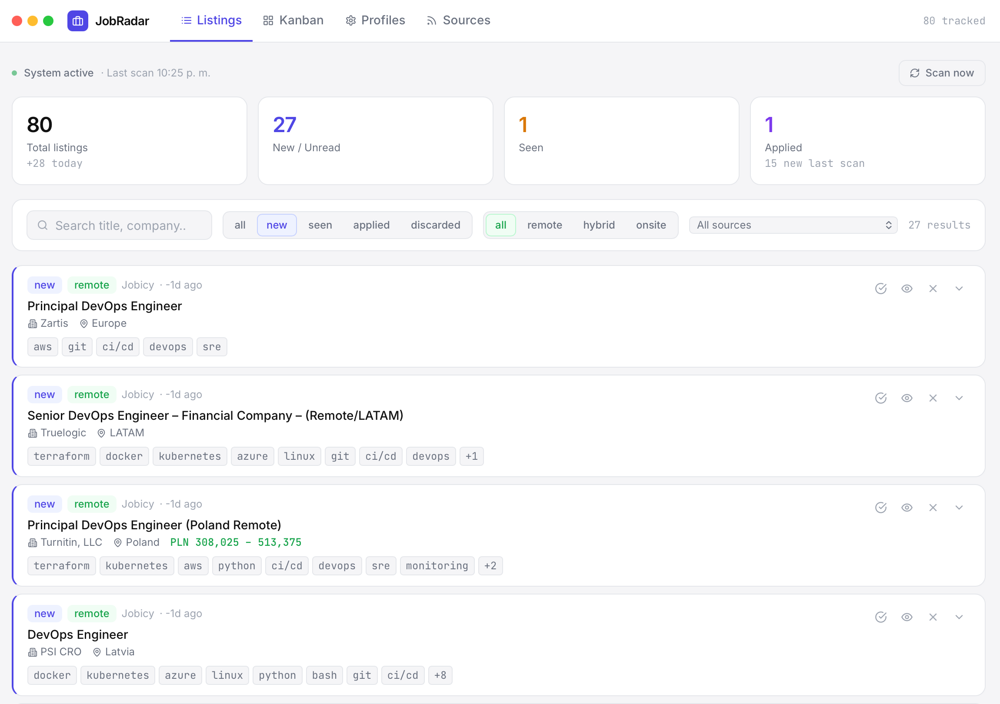

# 📡 JobRadar

> I automate everything at work. So I automated the job search too.

JobRadar is a self-hosted dashboard that aggregates job listings from 10+ boards, filters them by your profiles, and lets you track applications — all running on localhost via Docker.



---

## Why

Most job boards are noise. You end up with 10 tabs open, losing track of what you applied to, seeing the same listings twice across different sites.

This fixes that: one place, auto-refreshed every 2 hours, with status tracking (New → Seen → Applied) and a Kanban view.

---

## Architecture

Three Docker services sharing a SQLite volume:

- **fetcher** (Python) — pulls RSS feeds and JSON APIs every 2 hours, filters by keyword profiles, stores results
- **api** (FastAPI) — REST API serving jobs, stats, profiles, and sources
- **ui** (React + Nginx) — dashboard at `localhost:3000`

**Sources (RSS/API — zero cost):**
Remote OK · We Work Remotely · Himalayas · Working Nomads · Jobspresso · GetOnBrd · Jobicy

---

## Quick Start

```bash
git clone https://github.com/gnbratig/job-radar
cd job-radar

cp .env.example .env
# Add your ANTHROPIC_API_KEY to .env

docker compose up --build
```

Open **http://localhost:3000**

First fetch runs automatically on startup.

---

## Features

| Feature | Details |
|---|---|
| Auto-fetch | Every 2h, configurable via `FETCH_INTERVAL_HOURS` |
| Keyword filtering | Profiles filter listings before storing — no noise |
| Status tracking | New → Seen → Applied → Discarded |
| Kanban view | Visual pipeline across all statuses |
| Tech tag detection | Extracts stack from descriptions (Ansible, K8s, AWS…) |
| Work mode detection | Remote / Hybrid / Onsite auto-detected |
| Search & filters | By status, source, work mode, free text |
| Profile editor | Add/edit/delete keyword profiles from the UI |
| Source manager | Enable/disable individual sources from the UI |
| Notes | Per-listing notes field |
| Manual scan | Trigger fetch on demand from the dashboard |

---

## Configuration

### Search Profiles
Managed from the UI → **Profiles** tab. No config file needed.

Default profiles: DevOps · SRE · Infrastructure Engineer · Automation Engineer · Linux/SysAdmin

### Sources
Managed from the UI → **Sources** tab. Enable or disable any source without touching config files.

### Environment Variables

| Variable | Default | Description |
|---|---|---|
| `ANTHROPIC_API_KEY` | required | Anthropic API key |
| `FETCH_INTERVAL_HOURS` | `2` | How often to fetch new listings |

---

## Stack

| Layer | Tech |
|---|---|
| Fetcher | Python 3.12 · feedparser · requests |
| API | FastAPI · SQLite |
| UI | React 18 · Vite · Tailwind CSS |
| Infra | Docker Compose · Nginx |

---

## Project Structure

```
job-radar/
├── docker-compose.yml
├── .env.example
├── fetcher/
│   ├── main.py               # Orchestrator + scheduler
│   ├── config.yaml           # RSS source definitions
│   └── sources/
│       ├── rss_fetcher.py    # RSS/Atom feed parser
│       └── jobicy_fetcher.py # Jobicy JSON API client
├── api/
│   └── main.py               # FastAPI — jobs, stats, profiles, sources
├── db/
│   └── init.sql              # SQLite schema
└── ui/
    └── src/
        ├── App.jsx
        └── components/
            ├── StatsPanel.jsx
            ├── JobCard.jsx
            ├── FilterBar.jsx
            ├── KanbanView.jsx
            ├── ProfileConfig.jsx
            └── SourcesConfig.jsx
```

---

*Built by [Gabriel Bratig](https://www.linkedin.com/in/gabriel-bratig) — Senior DevOps & Infrastructure Automation Engineer*  
*Open to fully remote opportunities · [LinkedIn](https://www.linkedin.com/in/gabriel-bratig)*
